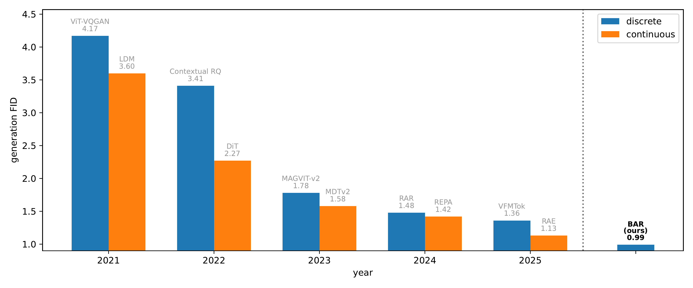
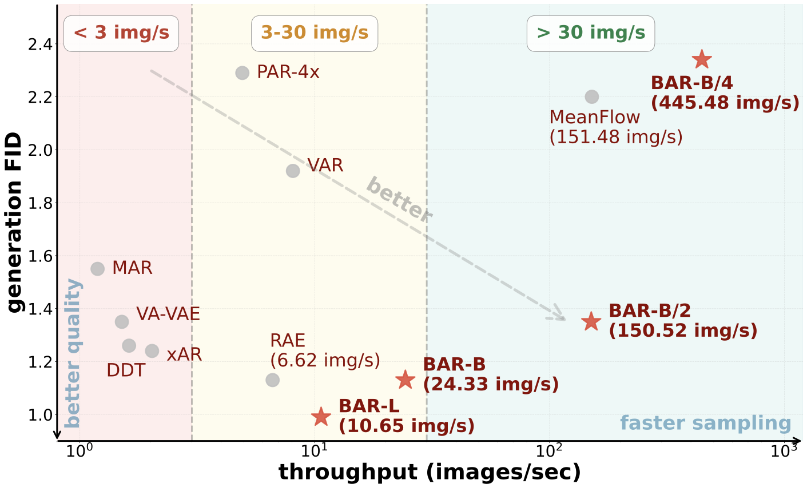

# 基于掩码比特建模的自回归图像生成

<div align="center">

[](https://bar-gen.github.io/)&nbsp;&nbsp;
[](https://arxiv.org/abs/2602.09024)&nbsp;&nbsp;

</div>

## 简介

视觉生成模型在计算机视觉任务中取得了显著进展。这些系统的核心组件是**视觉分词（visual tokenization）**，它将高维像素输入压缩为紧凑的潜在表示。根据量化策略的不同，视觉分词流程可分为*离散*和*连续*两种方法。尽管目前连续分词器结合扩散模型在视觉生成领域占据主导地位，但我们研究了这一差距究竟是根本性的，还是仅仅由设计选择造成的。

我们提出了 **BAR**（_masked **B**it **A**uto**R**egressive modeling，掩码比特自回归建模_），这是一个强大的离散视觉生成框架，挑战了连续流程的主导地位。我们的核心发现是：离散分词器常见的较差表现在很大程度上归因于其显著更高的压缩比，从而导致了严重的信息损失。

### 核心发现

**1. 离散分词器优于连续分词器**
通过扩大码本规模以匹配连续分词器的比特预算，我们证明离散分词器可以达到具有竞争力甚至更优的重建质量。

**2. 离散自回归模型优于扩散模型**
我们通过将标准线性预测头替换为轻量级的**掩码比特建模（Masked Bit Modeling, MBM）**头来解决词汇量扩展问题。这一设计能够在支持任意码本大小的同时保持优越的生成质量。BAR 在 ImageNet-256 上达到了最先进的 gFID **0.99**，超越了领先的连续和离散方法。

**3. 更高的效率**
与扩散模型相比，BAR 具有更低的采样成本和更快的收敛速度。我们的高效变体 BAR-B/4 比 MeanFlow 快 2.94 倍且性能相当；BAR-B 比 RAE 快 3.68 倍且达到相同的 FID（1.13 vs 1.13）。

<p align="center">
  
</p>
<p align="center">
<em>通过以比特为单位衡量信息容量，我们实现了离散分词器和连续分词器之间的直接比较。我们的离散分词器（BAR-FSQ）随码本大小平滑扩展，并在足够的比特预算下匹配或超越连续分词器。</em>
</p>

<p align="center">
  
</p>
<p align="center">
<em>BAR 在离散和连续两种范式中均建立了新的最先进水平。仅凭 4.15 亿参数，BAR-B 达到了 1.13 的 gFID，与 RAE 持平且速度显著更快。BAR-L（11 亿参数）达到了 0.99 的创纪录 gFID。</em>
</p>

## 方法概述

### BAR 框架

BAR 将自回归视觉生成分解为两个阶段：

1. **上下文建模**：自回归 Transformer 通过因果注意力捕获全局结构，为每个 token 位置生成潜在条件。

2. **Token 预测**：我们引入了**掩码比特建模（MBM）**头来替代在大词汇量下扩展性差的标准线性头，通过渐进式逐比特解码来生成离散 token。

### 掩码比特建模头

MBM 头将 token 预测视为条件生成任务，而非大规模分类问题：

- **可扩展性**：内存复杂度从 O(C) 降至 O(log₂ C)，其中 C 为码本大小
- **质量**：逐比特掩码起到强正则化作用，持续提升生成质量
- **灵活性**：无需架构改动即可支持任意码本大小

在推理时，MBM 头通过可配置的调度方案迭代解码每个 token（例如，[2, 2, 5, 7] 表示在 4 个步骤中分别解码 2、2、5、7 个比特）。

## 模型库

我们提供预训练的生成器模型：

| 模型         | 配置文件                                                 | 参数量 | gFID | IS    |
| ------------ | -------------------------------------------------------- | ------ | ---- | ----- |
| BAR-B/4      | [bar_b_patch4.yaml](configs/generator/bar_b_patch4.yaml) | 416M   | 2.34 | 274.7 |
| BAR-B/2      | [bar_b_patch2.yaml](configs/generator/bar_b_patch2.yaml) | 415M   | 1.35 | 293.4 |
| BAR-B        | [bar_b.yaml](configs/generator/bar_b.yaml)               | 415M   | 1.13 | 289.0 |
| BAR-L        | [bar_l.yaml](configs/generator/bar_l.yaml)               | 1.1B   | 0.99 | 296.9 |
| BAR-L-res512 | [bar_l_res512.yaml](configs/generator/bar_l_res512.yaml) | 1.1B   | 1.09 | 311.1 |

## 准备工作

### 环境配置

```shell
uv sync && source .venv/bin/activate
```

### 检查点配置

**从 HuggingFace 下载模型检查点：**

```bash
hf download FAR-Amazon/BAR-collections \
  --local-dir assets
```

这将把所有预训练模型（生成器、分词器和判别器权重）下载到 `assets/` 文件夹。

## 快速开始

### 训练

**数据准备：**

我们使用 webdataset 格式加载数据。首先需要将数据集转换为 webdataset 格式。[这里](https://github.com/bytedance/1d-tokenizer/blob/main/data/convert_imagenet_to_wds.py)提供了将 ImageNet 转换为 wds 格式的示例脚本。

**训练 BAR-FSQ 分词器：**

```bash
WANDB_MODE=offline WORKSPACE=/path/to/workspace \
accelerate launch --num_machines=1 --num_processes=8 \
    --machine_rank=0 --main_process_ip=127.0.0.1 \
    --main_process_port=9999 --same_network \
    scripts/train_bar_fsq.py \
    config=configs/tokenizer/bar_fsq_16bits.yaml \
    'dataset.params.train_shards_path_or_url=/path/to/imagenet-train-{000000..000320}.tar' \
    'dataset.params.eval_shards_path_or_url=/path/to/imagenet-val-{000000..000049}.tar'
```

**训练 BAR 生成器：**

可选步骤：将 ImageNet 数据集预分词为 NPZ 格式以加速训练：

```bash
# 注意：data_path 应指向原始 JPEG 格式的 ImageNet（包含 train/ 和 val/ 文件夹）
torchrun --nproc-per-node=8 scripts/pretokenization.py \
    --img_size 256 \
    --batch_size 32 \
    --vae_config_path configs/tokenizer/bar_fsq_16bits.yaml \
    --vae_path assets/tokenizer/bar_fsq_16bits.bin \
    --data_path /path/to/imagenet \
    --cached_path ./pretokenized_npz
```

训练生成器：

使用预分词数据：

```bash
WANDB_MODE=offline WORKSPACE=/path/to/workspace \
accelerate launch --num_machines=N --num_processes=$((8*N)) \
    --machine_rank=RANK --main_process_ip=MAIN_IP \
    --main_process_port=9999 --same_network \
    scripts/train_bar.py \
    config=configs/generator/bar_b_patch4.yaml \
    dataset.params.pretokenization=./pretokenized_npz \
    training.per_gpu_batch_size=$((2048 / (8*N)))
```

不使用预分词数据：

```bash
WANDB_MODE=offline WORKSPACE=/path/to/workspace \
accelerate launch --num_machines=N --num_processes=$((8*N)) \
    --machine_rank=RANK --main_process_ip=MAIN_IP \
    --main_process_port=9999 --same_network \
    scripts/train_bar.py \
    config=configs/generator/bar_b_patch4.yaml \
    'dataset.params.train_shards_path_or_url=/path/to/imagenet-train-{000000..000320}.tar' \
    'dataset.params.eval_shards_path_or_url=/path/to/imagenet-val-{000000..000049}.tar' \
    training.per_gpu_batch_size=$((2048 / (8*N)))
```

## 在 ImageNet-1K 上评估

我们提供了[采样脚本](./sample_imagenet.py)用于在 ImageNet-1K 基准上复现生成结果。

### 配置评估工具

```bash
# 准备 ADM 评估脚本
git clone https://github.com/openai/guided-diffusion.git

# 下载参考统计数据
wget https://openaipublic.blob.core.windows.net/diffusion/jul-2021/ref_batches/imagenet/256/VIRTUAL_imagenet256_labeled.npz
```

### 生成与评估

**示例：BAR-B/4**

```bash
# 生成样本
torchrun --nnodes=1 --nproc-per-node=1 --rdzv-endpoint=localhost:9999 \
    sample_imagenet.py \
    config=configs/generator/bar_b_patch4.yaml \
    experiment.output_dir="bar_b_patch4" \
    experiment.generator_checkpoint=assets/generator/bar_b_patch4.bin \
    experiment.tokenizer_checkpoint=assets/tokenizer/bar_fsq_16bits.bin \
    model.generator.guidance_scale=9.6 \
    model.generator.mbm_head.randomize_temperature=1.4 \
    'model.generator.mbm_head.tokens_allocation=[64,64,64,64]'

# 评估 FID
python3 guided-diffusion/evaluations/evaluator.py \
    VIRTUAL_imagenet256_labeled.npz \
    bar_b_patch4.npz

# 预期输出：
# Inception Score: 274.70697021484375
# FID: 2.3366168749295753
# sFID: 6.311607318546635
# Precision: 0.79364
# Recall: 0.5984
```

**示例：BAR-B/2**

```bash
# 生成样本
torchrun --nnodes=1 --nproc-per-node=1 --rdzv-endpoint=localhost:9999 \
    sample_imagenet.py \
    config=configs/generator/bar_b_patch2.yaml \
    experiment.output_dir="bar_b_patch2" \
    experiment.generator_checkpoint=assets/generator/bar_b_patch2.bin \
    experiment.tokenizer_checkpoint=assets/tokenizer/bar_fsq_16bits.bin \
    model.generator.guidance_scale=5.5 \
    model.generator.mbm_head.randomize_temperature=2.0 \
    'model.generator.mbm_head.tokens_allocation=[16,16,16,16]'

# 评估 FID
python3 guided-diffusion/evaluations/evaluator.py \
    VIRTUAL_imagenet256_labeled.npz \
    bar_b_patch2.npz

# 预期输出：
# Inception Score: 293.40704345703125
# FID: 1.3484216683129944
# sFID: 4.931784360145002
# Precision: 0.7887
# Recall: 0.6377
```

**示例：BAR-B**

```bash
# 生成样本
torchrun --nnodes=1 --nproc-per-node=1 --rdzv-endpoint=localhost:9999 \
    sample_imagenet.py \
    config=configs/generator/bar_b.yaml \
    experiment.output_dir="bar_b" \
    experiment.generator_checkpoint=assets/generator/bar_b.bin \
    experiment.tokenizer_checkpoint=assets/tokenizer/bar_fsq_16bits_ft.bin \
    model.generator.guidance_scale=5.0 \
    model.generator.mbm_head.randomize_temperature=2.5 \
    'model.generator.mbm_head.tokens_allocation=[2,2,5,7]'

# 评估 FID
python3 guided-diffusion/evaluations/evaluator.py \
    VIRTUAL_imagenet256_labeled.npz \
    bar_b.npz

# 预期输出：
# Inception Score: 289.0171813964844
# FID: 1.1292903682207225
# sFID: 4.692096472506364
# Precision: 0.77354
# Recall: 0.6635
```

**示例：BAR-L**

```bash
# 生成样本
torchrun --nnodes=1 --nproc-per-node=1 --rdzv-endpoint=localhost:9999 \
    sample_imagenet.py \
    config=configs/generator/bar_l.yaml \
    experiment.output_dir="bar_l" \
    experiment.generator_checkpoint=assets/generator/bar_l.bin \
    experiment.tokenizer_checkpoint=assets/tokenizer/bar_fsq_16bits_ft.bin \
    model.generator.guidance_scale=5.3 \
    model.generator.mbm_head.randomize_temperature=3.0 \
    'model.generator.mbm_head.tokens_allocation=[2,2,5,7]'

# 评估 FID
python3 guided-diffusion/evaluations/evaluator.py \
    VIRTUAL_imagenet256_labeled.npz \
    bar_l.npz

# 预期输出：
# Inception Score: 296.94757080078125
# FID: 0.9926468757014959
# sFID: 4.673216174301388
# Precision: 0.7693
# Recall: 0.6858
```

**示例：BAR-L-res512**

```bash
# 生成样本
torchrun --nnodes=1 --nproc-per-node=1 --rdzv-endpoint=localhost:9999 \
    sample_imagenet.py \
    config=configs/generator/bar_l_res512.yaml \
    experiment.output_dir="bar_l_res512" \
    experiment.generator_checkpoint=assets/generator/bar_l_res512.bin \
    experiment.tokenizer_checkpoint=assets/tokenizer/bar_sfq_10bits_res512.bin \
    model.generator.guidance_scale=4.2 \
    model.generator.mbm_head.randomize_temperature=2.8 \
    'model.generator.mbm_head.tokens_allocation=[2,2,2,4]'

# 评估 FID
python3 guided-diffusion/evaluations/evaluator.py \
    VIRTUAL_imagenet512.npz \
    bar_l_res512.npz

# 预期输出：
# Inception Score: 311.08929443359375
# FID: 1.0937443187164604
# sFID: 4.404387828127369
# Precision: 0.79574
# Recall: 0.644
```

## 引用

如果您觉得本工作有用，请引用：

```bibtex
@article{yu2026autoregressive,
  title     = {Autoregressive Image Generation with Masked Bit Modeling},
  author    = {Yu, Qihang and Liu, Qihao and He, Ju and Zhang, Xinyang and Liu, Yang and Chen, Liang-Chieh and Chen, Xi},
  journal   = {arXiv preprint},
  year      = {2026}
}
```

## 安全

更多信息请参阅 [CONTRIBUTING](CONTRIBUTING.md#security-issue-notifications)。

## 许可证

本项目基于 Apache-2.0 许可证。详情请参阅 [LICENSE](LICENSE) 文件。
